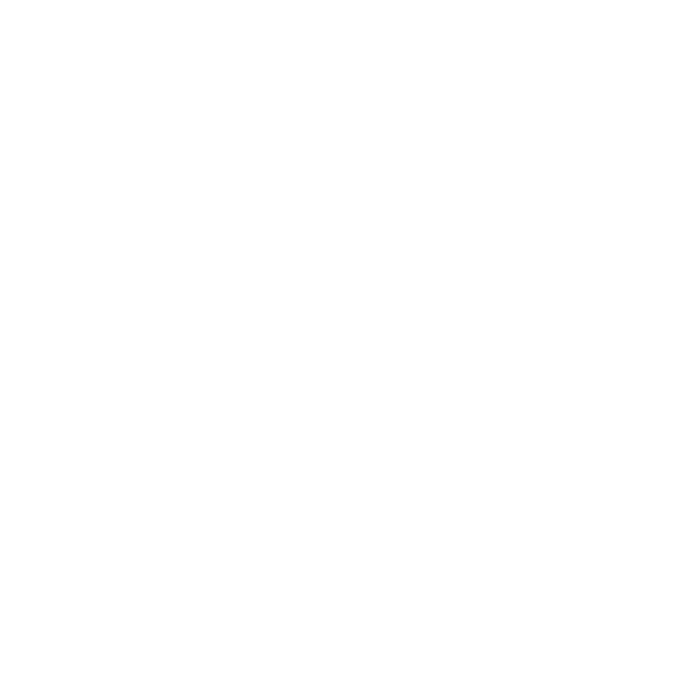
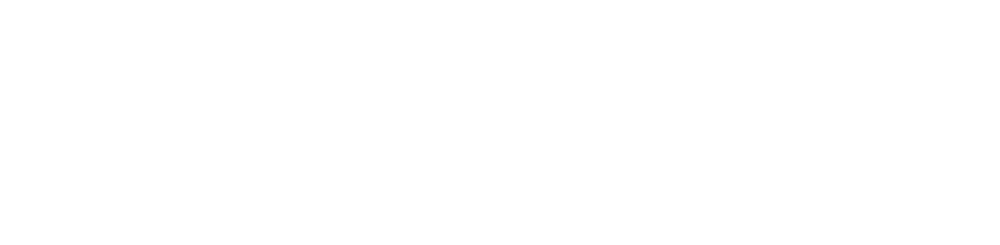

# Backslash Designs - Branding Assets

Welcome to the official branding repository for **Backslash Designs**. This repository contains logos, icons, and other brand-related assets for use across internal and external platforms such as Microsoft 365, websites, email signatures, and third-party integrations.

---

## 🌐 Public Logo URLs

| Category                         | Logo Color | Background Type | Preview                                                                  | Direct Link - Regular                                                                                                                                      | Direct Link - Small                                                                                                                                                    |
| -------------------------------- | ---------- | --------------- | ------------------------------------------------------------------------ | ---------------------------------------------------------------------------------------------------------------------------------------------------------- | ---------------------------------------------------------------------------------------------------------------------------------------------------------------------- |
| **Icon (Rounded)**               | Light      | White           |      | [Backslash-Icon-Rounded-Light.png](https://raw.githubusercontent.com/Backslash-Designs/branding/main/logos/icon/Backslash-Icon-Rounded-Light.png)          |                                                                                                                                                                        |
|                                  | Dark       | Black           |       | [Backslash-Icon-Rounded-Dark.png](https://raw.githubusercontent.com/Backslash-Designs/branding/main/logos/icon/Backslash-Icon-Rounded-Dark.png)            |                                                                                                                                                                        |
| **Square**                       | Light      | White           |        | [Backslash-Logo-Square-Light.png](https://raw.githubusercontent.com/Backslash-Designs/branding/main/logos/sqr/Backslash-Logo-Square-Light.png)             | [Backslash-Logo-Square-Light-Small.png](https://raw.githubusercontent.com/Backslash-Designs/branding/main/logos/sqr/Backslash-Logo-Square-Light-Small.png)             |
|                                  | Dark       | Black           |         | [Backslash-Logo-Square-Dark.png](https://raw.githubusercontent.com/Backslash-Designs/branding/main/logos/sqr/Backslash-Logo-Square-Dark.png)               | [Backslash-Logo-Square-Dark-Small.png](https://raw.githubusercontent.com/Backslash-Designs/branding/main/logos/sqr/Backslash-Logo-Square-Dark-Small.png)               |
|                                  | Light      | Transparent     |  | [Backslash-Logo-Square-Trans-Light.png](https://raw.githubusercontent.com/Backslash-Designs/branding/main/logos/sqr/Backslash-Logo-Square-Trans-Light.png) | [Backslash-Logo-Square-Trans-Light-Small.png](https://raw.githubusercontent.com/Backslash-Designs/branding/main/logos/sqr/Backslash-Logo-Square-Trans-Light-Small.png) |
|                                  | Dark       | Transparent     |   | [Backslash-Logo-Square-Trans-Dark.png](https://raw.githubusercontent.com/Backslash-Designs/branding/main/logos/sqr/Backslash-Logo-Square-Trans-Dark.png)   | [Backslash-Logo-Square-Trans-Dark-Small.png](https://raw.githubusercontent.com/Backslash-Designs/branding/main/logos/sqr/Backslash-Logo-Square-Trans-Dark-Small.png)   |
| **Rectangle**                    | Light      | White           |         | [Backslash-Logo-Rect-Light.png](https://raw.githubusercontent.com/Backslash-Designs/branding/main/logos/rect/Backslash-Logo-Rect-Light.png)                |                                                                                                                                                                        |
|                                  | Dark       | Black           |          | [Backslash-Logo-Rect-Dark.png](https://raw.githubusercontent.com/Backslash-Designs/branding/main/logos/rect/Backslash-Logo-Rect-Dark.png)                  |                                                                                                                                                                        |
|                                  | Light      | Transparent     |   | [Backslash-Logo-Rect-Trans-Light.png](https://raw.githubusercontent.com/Backslash-Designs/branding/main/logos/rect/Backslash-Logo-Rect-Trans-Light.png)    | [Backslash-Logo-Rect-Trans-Light-Small.png](https://raw.githubusercontent.com/Backslash-Designs/branding/main/logos/rect/Backslash-Logo-Rect-Trans-Light-Small.png)    |
|                                  | Dark       | Transparent     |    | [Backslash-Logo-Rect-Trans-Dark.png](https://raw.githubusercontent.com/Backslash-Designs/branding/main/logos/rect/Backslash-Logo-Rect-Trans-Dark.png)      | [Backslash-Logo-Rect-Trans-Dark-Small.png](https://raw.githubusercontent.com/Backslash-Designs/branding/main/logos/rect/Backslash-Logo-Rect-Trans-Dark-Small.png)      |
| **Signature**                    | Light      | Transparent     |   | [Backslash-Logo-Sign-Trans-Light.png](https://raw.githubusercontent.com/Backslash-Designs/branding/main/logos/sign/Backslash-Logo-Sign-Trans-Light.png)    |                                                                                                                                                                        |
|                                  | Dark       | Transparent     |    | [Backslash-Logo-Sign-Trans-Dark.png](https://raw.githubusercontent.com/Backslash-Designs/branding/main/logos/sign/Backslash-Logo-Sign-Trans-Dark.png)      |                                                                                                                                                                        |
| **M365 Test (backslashtest.ca)** | Mixed      | Mixed           |          | [BackslashTest-Icon-Light.png](https://raw.githubusercontent.com/Backslash-Designs/branding/main/logos/test/BackslashTest-Icon-Light.png)                  |                                                                                                                                                                        |
|                                  | Mixed      | Mixed           |          | [BackslashTest-Rect-Light.png](https://raw.githubusercontent.com/Backslash-Designs/branding/main/logos/test/BackslashTest-Rect-Light.png)                  | [BackslashTest-Rect-Light-Small.png](https://raw.githubusercontent.com/Backslash-Designs/branding/main/logos/test/BackslashTest-Rect-Light-Small.png)                  |

## 🌌 Fonts

The official logo fonts for **Backslash Designs** are as follows:

| Element   | Font          | Style | Source Link                                               |
| --------- | ------------- | ----- | --------------------------------------------------------- |
| Backslash | GoBold Italic | Logo  | [GoBold on DaFont](https://www.dafont.com/gobold.font)    |
| Designs   | Hack Italic   | Logo  | [Hack on Adobe Fonts](https://fonts.adobe.com/fonts/hack) |

---

## 📁 Repository Structure

```
branding-assets/  
├── logos/  
│   ├── icon/  
│   │   ├── Backslash-Icon-Rounded-Light.png  
│   │   └── Backslash-Icon-Rounded-Dark.png  
│   ├── sqr/  
│   │   ├── Backslash-Logo-Square-Light.png  
│   │   ├── Backslash-Logo-Square-Light-Small.png  
│   │   ├── Backslash-Logo-Square-Dark.png  
│   │   ├── Backslash-Logo-Square-Dark-Small.png  
│   │   ├── Backslash-Logo-Square-Trans-Light.png  
│   │   ├── Backslash-Logo-Square-Trans-Light-Small.png  
│   │   ├── Backslash-Logo-Square-Trans-Dark.png  
│   │   └── Backslash-Logo-Square-Trans-Dark-Small.png  
│   ├── rect/  
│   │   ├── Backslash-Logo-Rect-Light.png  
│   │   ├── Backslash-Logo-Rect-Dark.png  
│   │   ├── Backslash-Logo-Rect-Trans-Light.png  
│   │   ├── Backslash-Logo-Rect-Trans-Light-Small.png  
│   │   ├── Backslash-Logo-Rect-Trans-Dark.png  
│   │   └── Backslash-Logo-Rect-Trans-Dark-Small.png  
│   ├── sign/  
│   │   ├── Backslash-Logo-Sign-Trans-Light.png  
│   │   └── Backslash-Logo-Sign-Trans-Dark.png  
│   ├── test/  
│   │   ├── BackslashTest-Icon-Light.png  
│   │   ├── BackslashTest-Rect-Light.png  
│   │   └── BackslashTest-Rect-Light-Small.png  
├── fonts/  
│   └── font-references.md  
├── colors/  
│   └── brand-palette.md  
└── README.md  
```

---

## 📌 License & Usage

All assets in this repository are the intellectual property of **Backslash Designs** and may not be used without permission outside official projects, partnerships, or brand-approved content.

---

## 📬 Contact

For custom asset requests, licensing, or integration help, contact:
[business@backslashdesigns.ca](mailto:business@backslashdesigns.ca)
